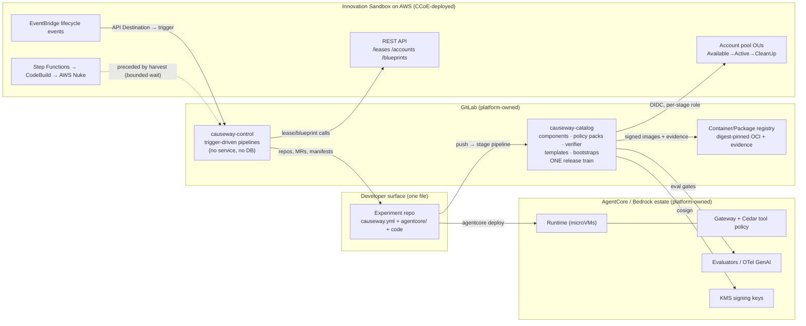
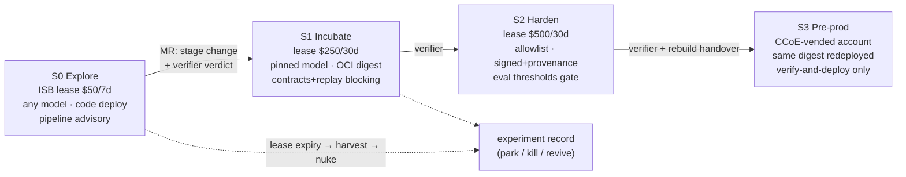
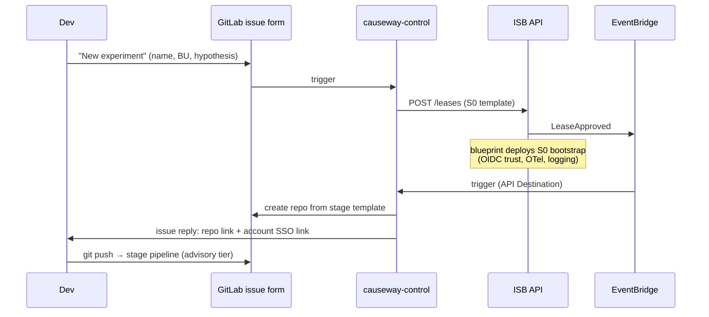
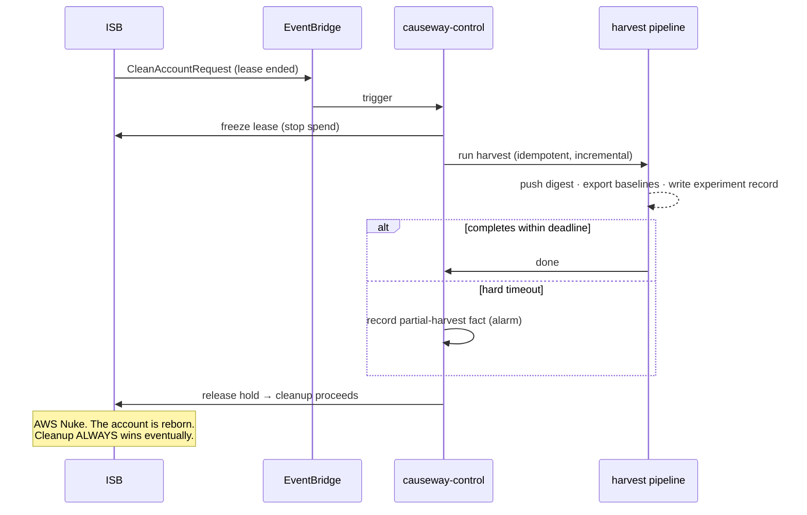

# Causeway — Architecture views

Companion to [`SPEC.md`](SPEC.md) (normative). These views are explanatory.

## 1. Component view — two operated things on two estates we own



Ownership boundary (ADR-0011): GitLab and the AgentCore estate are platform-owned;
ISB's org/OU/SCP layer is operated by the CCoE and consumed via API/events only.

## 2. Stage ladder (ADR-0003)



## 3. Sequence — birth of an experiment (ADR-0013, ADR-0015 in spec terms D15)



## 4. Sequence — harvest then nuke, bounded (ADR-0008)



Spike-0 caveat: whether stock ISB exposes a pre-cleanup hold point is **unverified**
([`SPIKES.md`](SPIKES.md) S0-1). Fallback design: harvest at the duration-threshold
alert (pre-expiry), accepting a small race window.

## 5. Evidence flow (ADR-0006, ADR-0010)

Finite artifacts in, decidable verdicts out — never "verify the program":

```
plan/policy-pack ─► policy-assertion-report ─┐
cassettes/replay ─► replay verdict ──────────┤   promotion manifest   verifier (catalog CLI)
eval suite (pinned model, N trials) ─► pass ─┼─► (machine-written) ─► signed verdict
image build ─► digest + SLSA-L1 + cosign ────┤                         = MR approvable
lineage stamps (template@ver + diff) ────────┘
```
